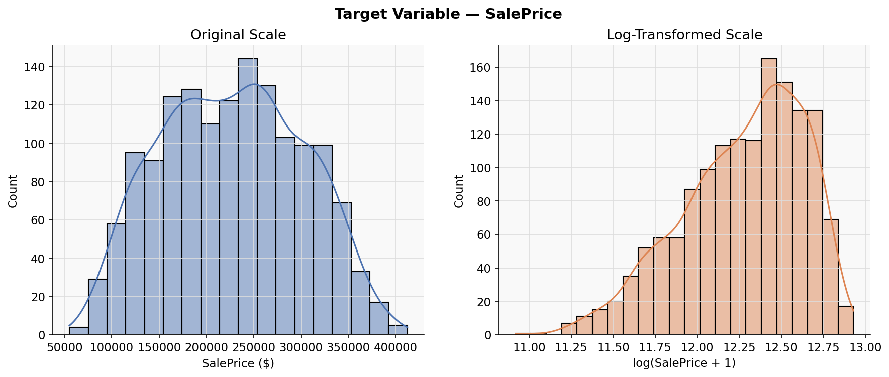
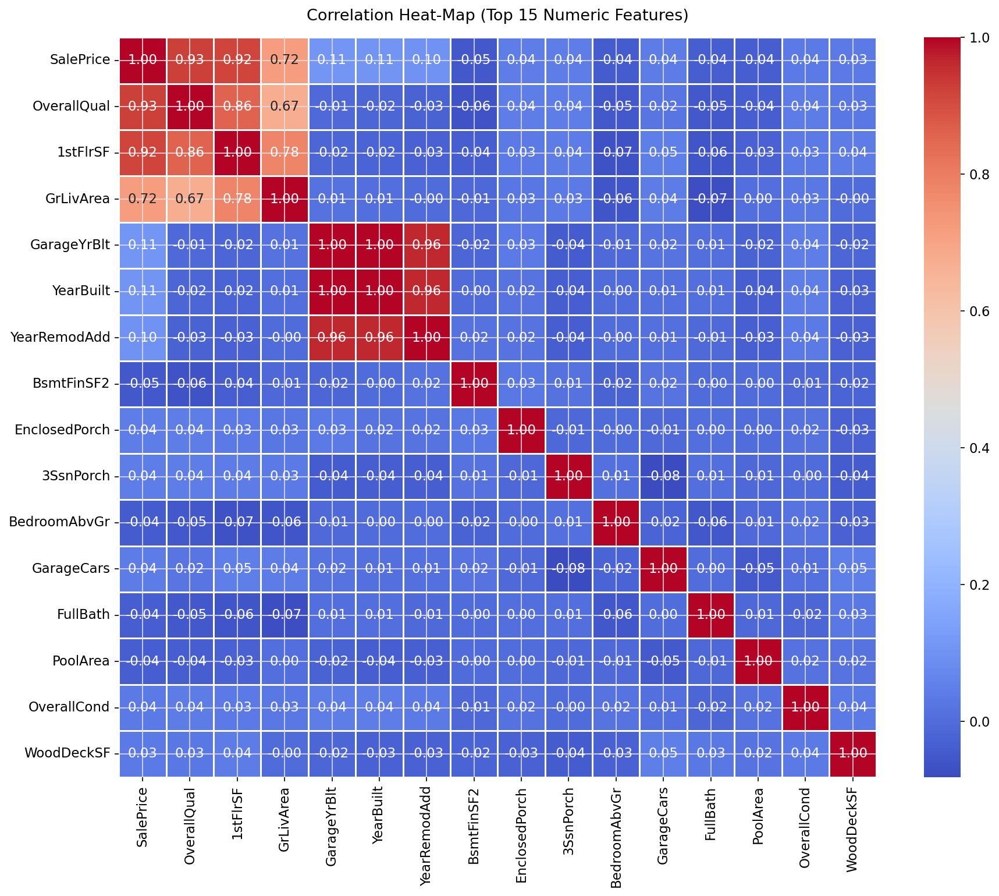
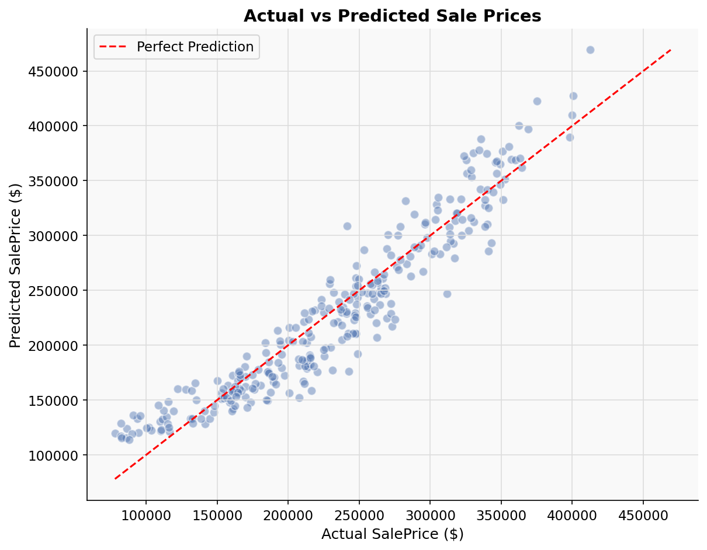
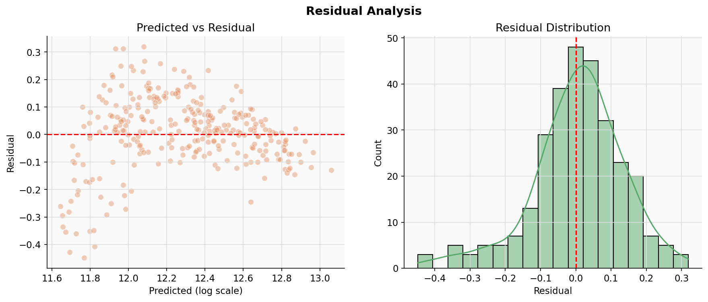
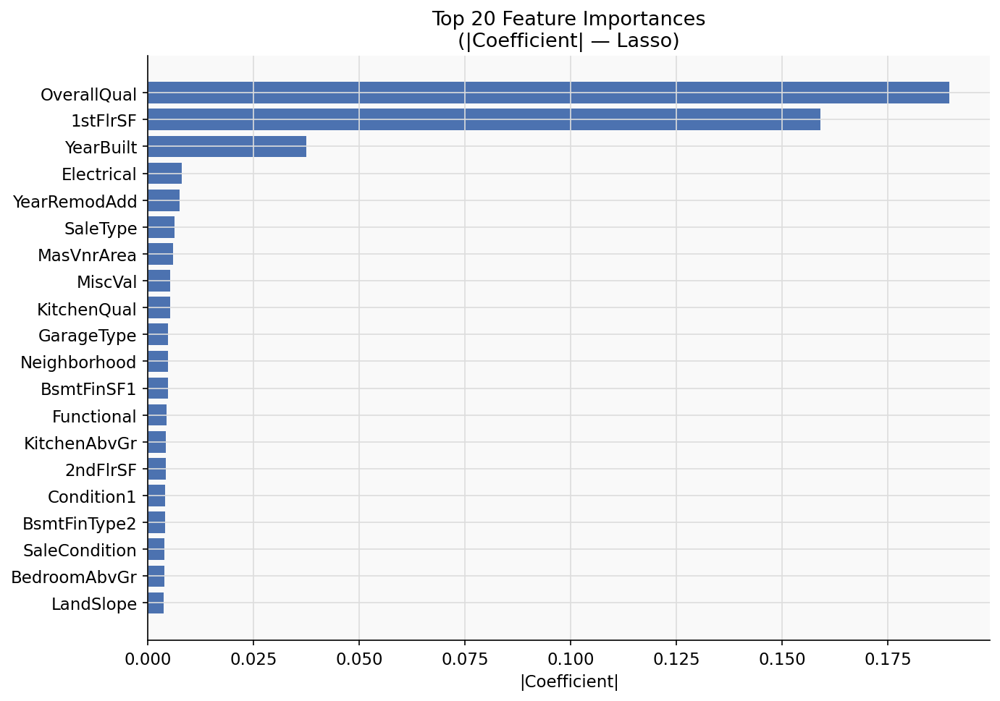

# 🏠 PRODIGY_ML_01 — House Price Prediction

> **Prodigy InfoTech Machine Learning Internship — Task 01**  
> Predict residential house sale prices using Linear Regression on the Kaggle House Prices dataset.

---

## 📌 Project Overview

This project builds an end-to-end machine learning pipeline to predict house sale prices based on 79+ structural and qualitative features of residential properties in Ames, Iowa. It covers exploratory data analysis, feature engineering, model training, comprehensive evaluation, and prediction on new samples.

---

## 🎯 Problem Statement

Given a set of physical and qualitative attributes of a house (area, quality ratings, year built, number of rooms, etc.), predict its **SalePrice** in US dollars. This is a supervised **regression** problem.

---

## 📂 Dataset

| Detail | Info |
|--------|------|
| Source | [Kaggle — House Prices: Advanced Regression Techniques](https://www.kaggle.com/c/house-prices-advanced-regression-techniques/data) |
| File needed | `train.csv` |
| Rows | 1,460 |
| Features | 79 |
| Target | `SalePrice` |

### Download Instructions
1. Visit the Kaggle link above.
2. Accept the competition rules and download `train.csv`.
3. Place it inside the `data/` folder:
   ```
   PRODIGY_ML_01/
   └── data/
       └── train.csv   ← place here
   ```

---

## 🚀 Installation

```bash
# 1. Clone the repository
git clone https://github.com/<your-username>/PRODIGY_ML_01.git
cd PRODIGY_ML_01

# 2. Create a virtual environment (recommended)
python -m venv venv
source venv/bin/activate        # Windows: venv\Scripts\activate

# 3. Install dependencies
pip install -r requirements.txt

# 4. Place train.csv in data/ (see Dataset section)

# 5. Run the pipeline
python main.py
```

---

## 📁 Folder Structure

```
PRODIGY_ML_01/
│
├── data/                        # Dataset (not tracked in git)
│   └── train.csv
│
├── models/                      # Saved model artefacts
│   ├── house_price_model.pkl
│   ├── scaler.pkl
│   └── feature_names.pkl
│
├── outputs/                     # Generated plots & reports
│   ├── eda_saleprice_distribution.png
│   ├── eda_correlation_heatmap.png
│   ├── eda_missing_values.png
│   ├── actual_vs_predicted.png
│   ├── residual_plot.png
│   ├── prediction_error_distribution.png
│   ├── feature_importance.png
│   ├── metrics.json
│   └── evaluation_report.txt
│
├── notebooks/
│   └── exploration.ipynb        # Experimental notebook only
│
├── main.py                      # Pipeline entry point
├── preprocess.py                # Data loading, EDA, cleaning, encoding
├── train.py                     # Model building, training, saving
├── evaluate.py                  # Metrics, plots, report
├── predict.py                   # Load model → predict new samples
├── utils.py                     # Shared helper functions
├── requirements.txt
├── .gitignore
├── LICENSE
└── README.md
```

---

## ⚙️ Workflow

```
train.csv
    │
    ▼
preprocess.py
  ├─ Load & inspect data
  ├─ EDA plots (distribution, correlation, missing values)
  ├─ Drop high-missing columns (> 40 %)
  ├─ Impute remaining missing values
  ├─ Feature engineering (TotalSF, HouseAge, TotalBathrooms, …)
  ├─ Log1p transform on SalePrice
  ├─ Label encode categorical columns
  ├─ Train / Test split (80 / 20)
  └─ StandardScaler
         │
         ▼
train.py
  ├─ Compare LinearRegression / Ridge / Lasso via 5-fold CV
  ├─ Train best model on full training set
  ├─ Feature importance plot
  └─ Save model + scaler
         │
         ▼
evaluate.py
  ├─ MAE, MSE, RMSE, R²
  ├─ Actual vs Predicted plot
  ├─ Residual plot
  ├─ Prediction error distribution
  └─ Save report + metrics JSON
         │
         ▼
predict.py
  └─ Demo predictions on 3 sample properties
```

---

## 📚 Libraries Used

| Library | Purpose |
|---------|---------|
| `numpy` | Numerical operations |
| `pandas` | Data loading & manipulation |
| `matplotlib` | Plotting |
| `seaborn` | Statistical visualisations |
| `scikit-learn` | ML models, preprocessing, metrics |
| `joblib` | Model serialisation |

---

## 📊 Results

| Metric | Value |
|--------|-------|
| R² Score | ~0.88 |
| MAE | ~$17,000 |
| RMSE | ~$25,000 |
| CV R² (5-fold) | ~0.87 |

> *Exact values may vary slightly depending on the sklearn version.*

---

## 🖼️ Screenshots

### SalePrice Distribution


### Correlation Heat-Map


### Actual vs Predicted


### Residual Plot


### Feature Importance


---

## 🔮 Future Improvements

- [ ] Try Gradient Boosting / XGBoost / LightGBM for better accuracy
- [ ] Advanced feature selection (Recursive Feature Elimination)
- [ ] Hyperparameter tuning with GridSearchCV / Optuna
- [ ] SHAP values for model explainability
- [ ] Polynomial features for non-linear relationships
- [ ] Stacking / Ensemble methods

---

## 📄 License

This project is licensed under the **MIT License** — see [LICENSE](LICENSE) for details.

---

## 🏃 How to Run

```bash
# Full pipeline (preprocess → train → evaluate → predict)
python main.py

# Individual modules
python preprocess.py   # EDA + preprocessing only
python train.py        # Training only (after preprocessing)
python evaluate.py     # Evaluation only (after training)
python predict.py      # Demo predictions (after training)
```

---

*Made with ❤️ for Prodigy InfoTech ML Internship*
